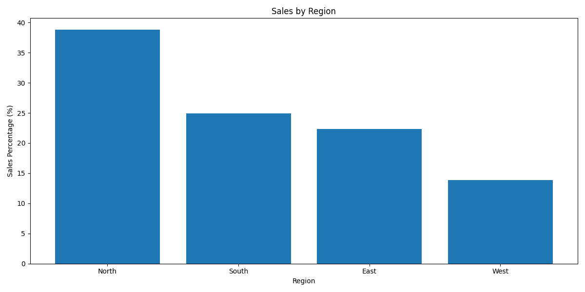
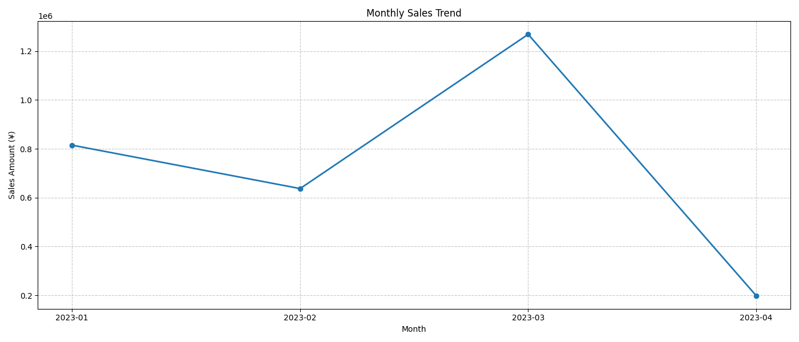
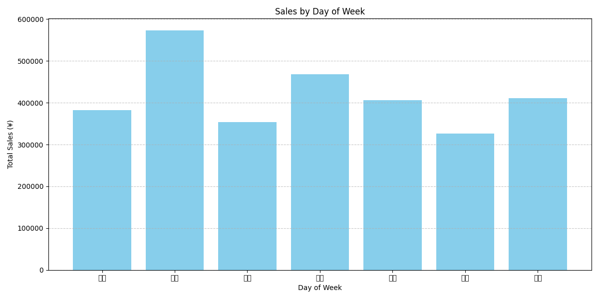
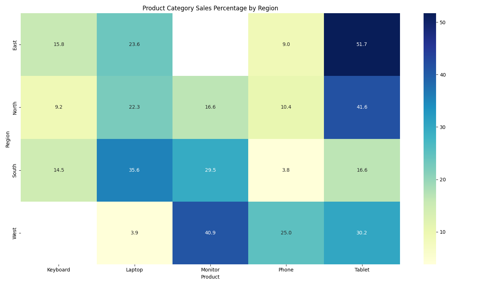
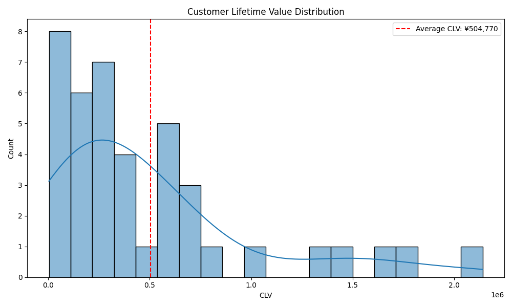
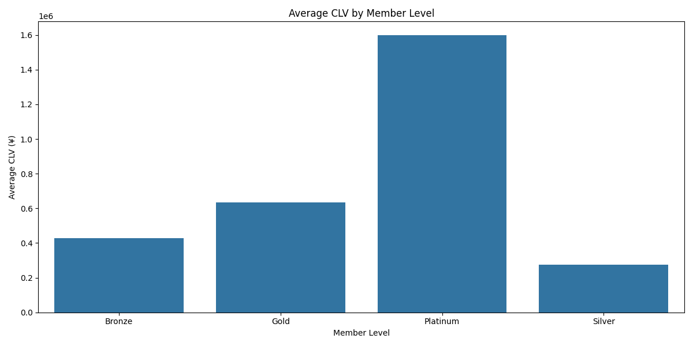
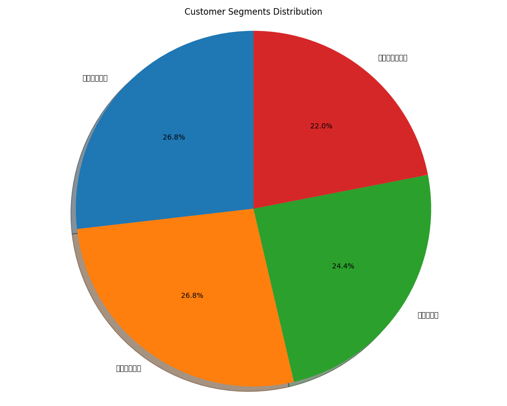
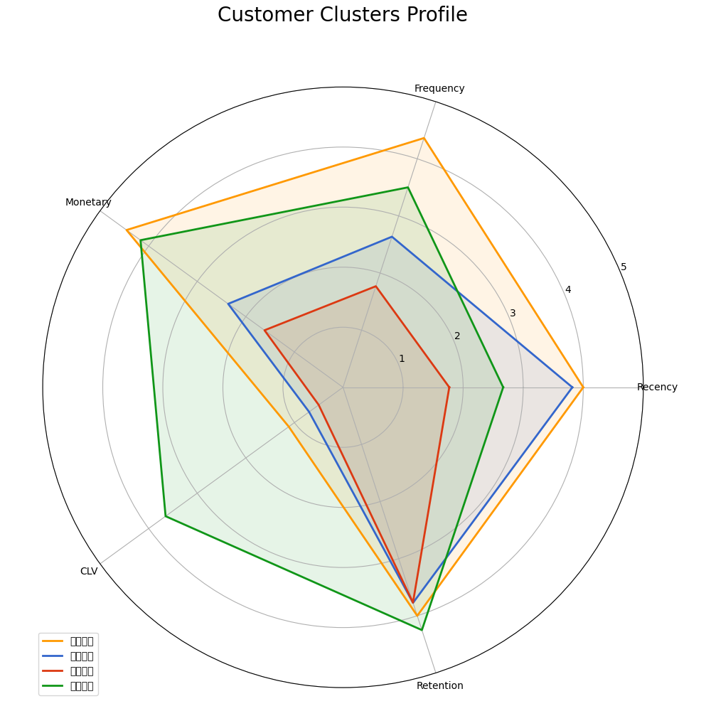
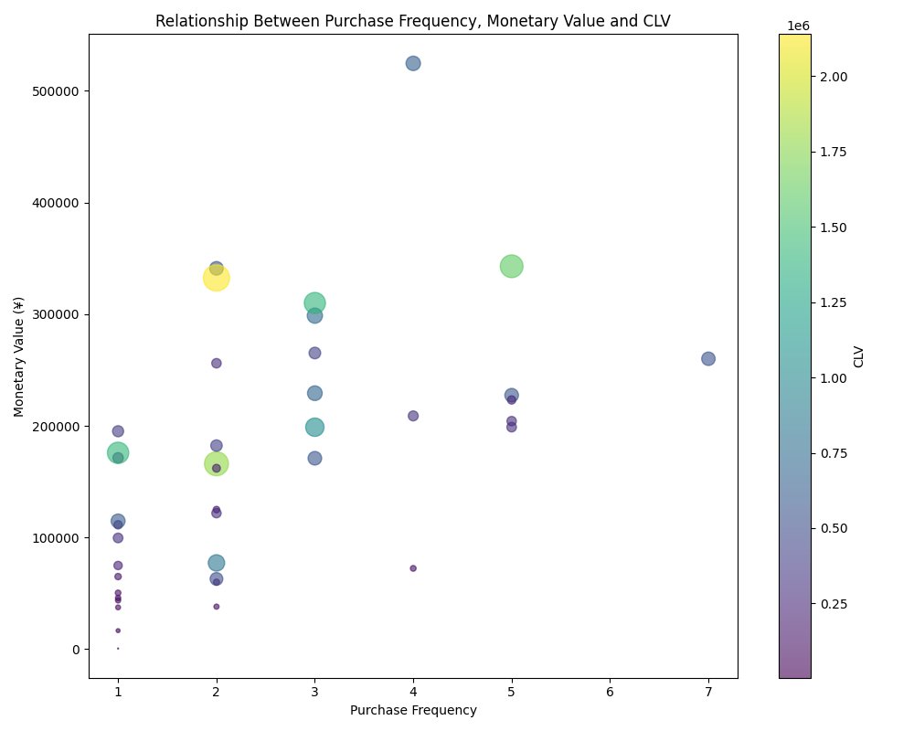

# 业务分析综合报告

## 目录
1. [执行摘要](#执行摘要)
2. [数据预处理分析](#数据预处理分析)
   - [数据质量评估](#数据质量评估)
   - [数据处理方法](#数据处理方法)
   - [主要发现与挑战](#主要发现与挑战)
3. [销售分析洞察](#销售分析洞察)
   - [销售总体概况](#销售总体概况)
   - [时间维度分析](#时间维度分析)
   - [产品与区域表现](#产品与区域表现)
   - [关键销售发现](#关键销售发现)
4. [客户分析结论](#客户分析结论)
   - [客户生命周期价值](#客户生命周期价值)
   - [客户细分与画像](#客户细分与画像)
   - [客户行为模式](#客户行为模式)
5. [策略建议](#策略建议)
   - [销售策略优化](#销售策略优化)
   - [客户关系管理改进](#客户关系管理改进)
   - [产品组合调整](#产品组合调整)
6. [行动计划](#行动计划)
   - [优先行动项目](#优先行动项目)
   - [实施路线图](#实施路线图)
   - [关键绩效指标](#关键绩效指标)
7. [附录：核心数据摘要](#附录核心数据摘要)

---

## 执行摘要

本报告综合了数据预处理、销售分析和客户分析三个阶段的关键发现，旨在为业务决策提供全面的数据支持。通过对销售数据和客户行为的深入分析，我们识别了业务中的优势和挑战，并提出了具体的改进策略。

关键发现包括：

- 产品表现：**Tablet** 是最畅销产品，占总销售额的 **37.8%**，而 **Phone** 销售表现最弱
- 区域差异：**North** 区域贡献了最高销售额（**38.8%**），而 **West** 区域表现最低（**13.9%**）
- 客户细分：约 **24.4%** 的客户被识别为高价值客户，而 **26.8%** 的客户存在流失风险
- 时间模式：**周三**销售表现最佳，**3月**显示出显著增长（环比增长 **99.2%**）
- 会员价值：**铂金会员**的客户生命周期价值显著高于其他会员级别，约为 **¥1,597,694**

基于这些发现，我们提出了针对性的业务优化策略，包括区域化产品组合调整、针对不同客户群体的营销方案以及提升客户留存率的措施。实施这些策略预计将提高总体销售业绩、提升客户满意度并增强业务长期竞争力。

---

## 数据预处理分析

### 数据质量评估

初始数据集包含了销售记录以及客户信息，但存在一定比例的数据质量问题：

- **缺失值**：原始数据中约有10%的单元格存在缺失值，主要集中在产品名称、区域和销售数量字段
- **异常值**：销售数量字段中检测到约5个极端值，这些值显著高于正常分布范围
- **数据格式不一致**：日期字段格式不统一，需要标准化处理

### 数据处理方法

针对上述问题，采用了以下处理方法：

1. **缺失值处理**：
   - 数值型字段（销售数量、单价）使用均值填充
   - 分类字段（产品名称、类别、区域）使用众数填充

2. **异常值处理**：
   - 采用IQR（四分位距）方法识别异常值
   - 将超出上限的值替换为上限值，使数据分布更合理

3. **数据转换**：
   - 标准化日期格式并提取年、月、周、星期等时间维度
   - 创建销售金额字段（销售数量 × 单价）
   - 对分类变量进行独热编码，便于后续分析

### 主要发现与挑战

通过预处理阶段，我们发现并解决了以下主要挑战：

1. **数据质量不一致**：原始数据中的缺失值和异常值会导致分析结果偏差，经过清洗后，数据质量显著提升
2. **时间维度缺失**：原始数据缺乏明确的时间维度划分，通过提取日期特征，增强了时间序列分析能力
3. **分类变量编码**：将文本分类变量转换为数值编码，使机器学习模型能够有效处理
4. **特征创建**：通过创建销售金额、客户生命周期等派生特征，丰富了分析维度

预处理后的数据集为后续的销售和客户分析提供了高质量的基础，极大地提高了分析结果的可靠性和准确性。

---

## 销售分析洞察

### 销售总体概况

销售分析的基本统计数据显示，公司总销售额达到 **¥3,160,152**，平均订单金额为 **¥31,602**。从产品类别来看，销售额分布如下：

| 产品类别 | 销售占比 | 销售额 |
|---------|---------|--------|
| Tablet  | 37.8%   | ¥1,193,849 |
| Monitor | 24.3%   | ¥768,654 |
| Laptop  | 21.4%   | ¥675,043 |
| Keyboard| 9.3%    | ¥295,215 |
| Phone   | 7.2%    | ¥227,390 |

从区域分布来看，销售额主要集中在以下区域：

### 时间维度分析

销售数据在时间上呈现出明显的波动性和季节性特征：

关键时间维度发现：
- **月度趋势**：3月销售额最高，环比增长99.2%，达到¥1,269,107
- **季度表现**：第一季度（Q1）销售额为¥2,721,269，占全年主要份额
- **周内分布**：周三销售表现最好，贡献¥572,558销售额

### 产品与区域表现

产品在不同区域的表现存在显著差异：

区域产品偏好特点：
- **East区域**：Tablet最受欢迎（51.7%）
- **North区域**：Tablet占比最高（41.6%）
- **South区域**：Laptop销售占比最高（35.6%）
- **West区域**：Monitor表现最佳（40.9%）

### 关键销售发现

综合分析得出以下关键销售洞察：

1. **产品表现差异显著**：Tablet销售额远超其他产品，是核心产品
2. **区域不平衡**：North区域表现强劲，West区域相对薄弱
3. **产品-区域匹配度**：不同区域对产品的偏好差异明显，暗示应采用区域化销售策略
4. **时间模式**：存在明确的月度和星期销售高峰，可指导营销活动时机选择
5. **平均订单价值**：较高的平均订单值(¥31,602)表明客户购买力强，但也可能限制购买频率

---

## 客户分析结论

### 客户生命周期价值

客户生命周期价值(CLV)分析揭示了客户长期价值的分布情况：

CLV关键发现：
- **平均CLV**：¥504,770
- **CLV分布**：从最低的¥3,293到最高的¥2,140,043，分布较为分散
- **会员等级影响**：铂金会员的平均CLV(¥1,597,694)显著高于其他等级

### 客户细分与画像

基于RFM(Recency, Frequency, Monetary)方法的客户细分显示：

客户细分比例：
- 高价值客户：24.4%
- 有增长潜力客户：22.0% 
- 一般价值客户：26.8%
- 流失风险客户：26.8%

高价值客户画像：
- 平均年龄：43岁
- 性别分布：男女各占50%
- 平均购买频率：4.2次
- 平均消费金额：¥285,987
- 平均CLV：¥749,306
- 会员分布：黄金会员(50%)、白银会员(30%)、青铜会员(20%)

### 客户行为模式

不同客户群体展现出不同的行为模式：

客户行为特点：
- **高价值客户**：最近购买时间短(21天)，购买频率高(4.2次)，客户生命周期长(72天)
- **有增长潜力客户**：消费金额适中(¥215,748)，较长客户生命周期(51天)
- **一般价值客户**：购买频率较低(1.7次)，消费金额较低(¥123,473)
- **流失风险客户**：最近购买时间长(84天)，购买频率最低(1.1次)，生命周期短(2.4天)

购买行为与CLV的关系图显示频率和金额对客户价值的直接影响：

---

## 策略建议

### 销售策略优化

基于销售分析结果，建议以下销售策略优化：

1. **区域差异化策略**
   - 针对North区域：维持高销售势头，探索提升客单价的机会
   - 针对West区域：增加营销投入，提高品牌知名度，考虑推出区域专属促销
   - 跨区域经验分享：分析North区域成功因素，复制到其他区域

2. **产品组合调整**
   - 根据区域偏好调整库存分配：East和North重点配置Tablet，South侧重Laptop，West侧重Monitor
   - 针对Phone产品线：评估其低销售表现原因，考虑产品升级或重新定位

3. **时间营销策略**
   - 周内策略：周三增加促销活动，周四加强市场推广
   - 月度策略：把握Q1季度高销售窗口，特别是3月份
   - 淡季策略：在4月等销售低谷期推出限时特惠或捆绑销售

4. **价格策略优化**
   - 为高销量产品(Tablet)开发多层次价格结构，满足不同客户群体
   - 考虑为表现不佳产品(Phone)调整定价，评估价格弹性

### 客户关系管理改进

针对不同客户群体的特点，建议以下客户关系管理改进方案：

1. **高价值客户维护**
   - 实施VIP会员计划，提供专属优惠和优先服务
   - 指派专属客户经理，提供一对一服务
   - 邀请参与新产品测试和提前购买权
   - 组织高端社交活动，增强品牌忠诚度

2. **有增长潜力客户提升**
   - 基于历史购买记录推送相关产品推荐
   - 实施阶梯式积分奖励计划，鼓励提升购买频率
   - 提供明确的会员升级路径和福利展示
   - 建立定期回访机制，了解需求变化

3. **一般价值客户激活**
   - 强调产品价值与价格优势，改善价值感知
   - 创造紧迫感的限时折扣活动
   - 设置合理的满额送礼阈值，增加客单价
   - 增加线上互动频率，提高品牌粘性

4. **流失风险客户挽留**
   - 发送个性化的重新激活邮件
   - 提供一次性特别折扣以重新激活购买
   - 开展客户流失原因调查，收集改进意见
   - 简化购买流程，减少购买障碍

### 产品组合调整

基于产品销售表现和客户偏好，建议以下产品组合调整：

1. **核心产品强化**
   - Tablet产品线：扩展产品系列，满足不同价位需求
   - Monitor产品：强化在West区域的营销，研发符合该区域偏好的新型号

2. **低表现产品改进**
   - Phone产品线：评估产品定位与市场预期的匹配度，考虑功能升级或价格调整
   - 开发Phone与其他产品的捆绑销售方案，提升销量

3. **产品创新方向**
   - 基于高价值客户偏好开发新产品
   - 探索Tablet与Monitor的融合产品，抓住这两个热销品类的交叉市场

4. **区域化产品策略**
   - 为East区域开发Tablet特供版本
   - 为South区域优化Laptop产品线
   - 为West区域设计Monitor专属促销套装

---

## 行动计划

### 优先行动项目

基于分析结果和策略建议，建议优先实施以下行动项目：

1. **高价值客户维护计划** (高优先级)
   - 行动：推出高价值客户VIP会员计划
   - 预期效果：提高高价值客户留存率5-10%，增加复购率
   - 责任部门：客户关系管理团队

2. **区域产品组合优化** (高优先级)
   - 行动：根据区域偏好调整产品库存和促销策略
   - 预期效果：提高区域销售表现，缩小区域间差异
   - 责任部门：销售团队和产品管理团队

3. **流失风险客户挽回活动** (中优先级)
   - 行动：针对流失风险客户设计专属挽回营销活动
   - 预期效果：降低客户流失率5-8%，提高再活跃率
   - 责任部门：市场营销团队

4. **周三销售优化计划** (中优先级)
   - 行动：优化周三的销售流程和客户体验
   - 预期效果：提高周三销售额10-15%
   - 责任部门：销售团队和客户服务团队

5. **产品价格弹性测试** (低优先级)
   - 行动：对Phone等低表现产品进行价格弹性测试
   - 预期效果：确定最优定价策略，提高销售量
   - 责任部门：产品团队和市场研究团队

### 实施路线图

以下是战略实施的时间表和里程碑：

**第一阶段（1-3个月）：基础优化**
- 启动高价值客户维护计划
- 执行区域产品组合初步调整
- 开展客户流失原因调查分析
- 建立销售监控数据看板，追踪关键指标

**第二阶段（4-6个月）：策略深化**
- 推出定制化的客户群体营销活动
- 实施产品价格调整和促销优化
- 开发新的会员积分和奖励机制
- 优化时间维度销售策略（周度、月度）

**第三阶段（7-12个月）：创新发展**
- 基于高价值客户偏好开发新产品线
- 实施完整的客户生命周期管理计划
- 建立客户价值预测模型
- 开发客户流失预警系统
- 调整长期产品规划和定位策略

### 关键绩效指标

为衡量策略实施效果，建立以下关键绩效指标(KPI)：

**销售表现KPI**
- 总销售额增长率：目标15-20%
- 区域销售平衡度：降低区域间差异30%
- 产品销售多样性：降低单一产品依赖度10%
- 平均订单金额：提升5-10%

**客户价值KPI**
- 客户留存率：提高10%
- 高价值客户比例：从24.4%提升至30%
- 流失风险客户比例：从26.8%降低至20%以下
- 平均客户生命周期价值：提升15%

**营销效果KPI**
- 营销活动转化率：提高12%
- 客户获取成本：降低8%
- 客户挽回率：达到25%以上
- 会员等级提升率：提高15%

**运营效率KPI**
- 库存周转率：提高20%
- 产品-区域匹配度：提高15%
- 促销ROI：提高10%
- 客户服务满意度：达到90%以上

---

## 附录：核心数据摘要

### 销售数据摘要

| 指标 | 数值 |
|------|------|
| 总销售额 | ¥3,160,152 |
| 平均订单金额 | ¥31,602 |
| 最畅销产品 | Tablet (37.8%) |
| 最畅销区域 | North (38.8%) |
| 最佳销售日 | 周三 |
| 最佳销售月 | 3月 |

### 客户数据摘要

| 指标 | 数值 |
|------|------|
| 平均客户生命周期价值 | ¥504,770 |
| 平均购买频率 | 2.44次 |
| 平均客户留存率 | 78.05% |
| 高价值客户比例 | 24.39% |
| 流失风险客户比例 | 26.83% |
| 铂金会员平均CLV | ¥1,597,694 |

### 产品-区域偏好摘要

| 区域 | 最受欢迎产品 | 占比 |
|------|------------|------|
| East | Tablet | 51.7% |
| North | Tablet | 41.6% |
| South | Laptop | 35.6% |
| West | Monitor | 40.9% |